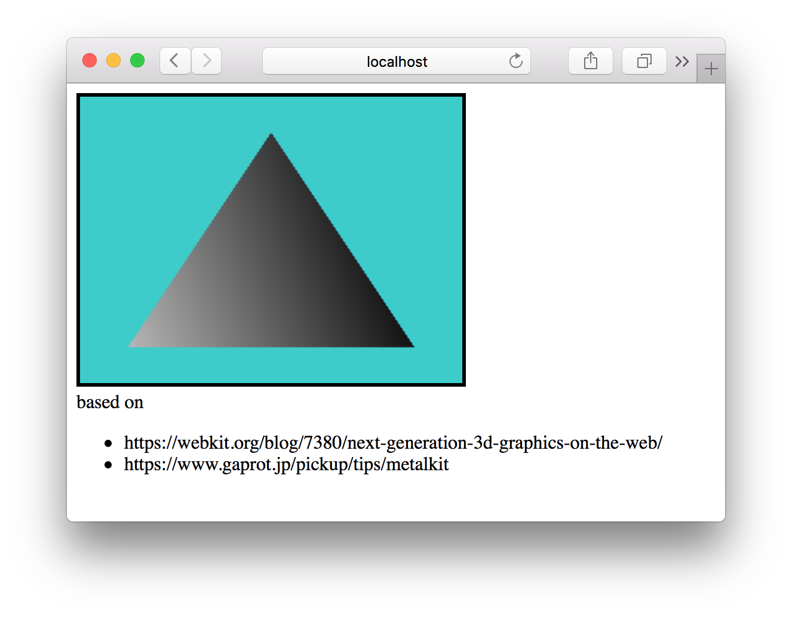

# webgpu-example
Appleから提案された、Webブラウザ上でGPUを活用できる規格"WebGPU"の利用サンプル

[提案記事](https://webkit.org/blog/7380/next-generation-3d-graphics-on-the-web/)
の通りにサンプルを作っても、実装と整合性が取れておらず動かせないという問題があります。
そこで、実際に動くように修正を加える方法について説明します。

# 環境
Mac OS X El Capitan以降

今のところ、WebGPUはMetalをベースとしているためMac以外では試せません。

# WebKitのビルド
事前にXcodeのインストールが必要ですので、 https://webkit.org/build-tools/ を参考に入れておきます。

以下の順にコマンドを叩くことで、WebGPUパッチを当てた状態のWebKitがビルドできます。

```
curl -o webgpu.patch 'https://bug-167952-attachments.webkit.org/attachment.cgi?id=300839'
git clone git://git.webkit.org/WebKit.git WebKit.git
git checkout f0884a3
git apply ../webgpu.patch
cd Tools/Scripts/
./build-webkit --debug
```

手元のMacbook Proでは`git clone`に2時間、`build-webkit`に2時間ぐらいかかりました。
`git checkout f0884a3`は、パッチと整合性の取れるリビジョンを探して選びました。

ビルド済みのWebKitを用いたSafariの実行は以下のコマンドです。

```
./run-safari --debug
```

# サンプルの実行
このリポジトリをcloneして、適当なHTTPサーバをローカルに立ててSafariから`canvas.html`にアクセスすればサンプルが実行できます。

Python2系なら`python -m SimpleHTTPServer`、Python3系なら`python -m http.server`が手軽です。
http://localhost:8000/
コマンドを実行したディレクトリの中身が、上のURLでアクセスできるようになります。

環境構築がうまくいっていれば、以下のような画面になるはずです。



# 提案記事からの変更点
シェーダのコードがなかったため、 [gaprot.jp](https://www.gaprot.jp/pickup/tips/metalkit) のサンプルコードを利用させていただいています。

公式サンプルでは
`passDescriptor.colorAttachments[0].loadAction = "clear";`
などのように、文字列で設定を行う箇所がいくつかありますが、これは動きませんでした。
`passDescriptor.colorAttachments[0].loadAction = gpu.LoadActionClear;`
と書き換えると動作しました(`gpu=canvas.getContext("webgpu");`)。その他の文字列利用部分も同じです。
